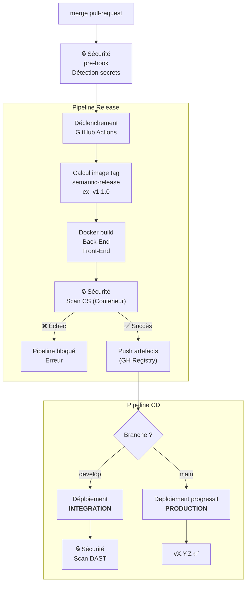

## Guide d'utilisation du pipeline Release/CD

Le pipeline Release/CD automatise la génération et l’analyse de sécurité des images Docker, puis leur déploiement sur les environnements d'intégration (staging) et de production. 

En tant que développeur :

- Le pipeline Release/CD est déclenché sur tout merge d'une pull-request sur les branches develop et main. Aucune intervention manuelle supplémentaire n'est nécessaire.

- Lors de la validation de la pull-request, GitHub Actions déclenche automatiquement le pipeline Release.
    - Une nouvelle version de l’application est calculée automatiquement avec semantic-release (ex. v1.1.0)
    - Les images Docker du Front-End et du Back-End sont construites
    - Les images Docker sont analysées afin de détecter d’éventuelles vulnérabilités

- Si les contrôles sont validés, les images sont publiées dans le GitHub Container Registry

- Si le scan de sécurité des conteneurs échoue ❌
    - le pipeline Release est bloqué et le résultat du job en erreur est consultable dans GitHub Actions. 
    - Le problème doit être corrigé avant qu’une nouvelle version puisse être publiée.
    - Après correction et nouveau push, le pipeline redémarre automatiquement

- Une fois les artefacts publiés, le pipeline CD déploie automatiquement l’application selon la branche concernée.

- Si la branche est develop :
    - L’application est déployée automatiquement sur l’environnement d’<b>INTÉGRATION</b>
    - Un scan de sécurité DAST est exécuté sur l’application déployée
    - Si les contrôles passent ✅, la nouvelle version est considérée comme déployée et disponible en intégration

- Si la branche est main :
    - L’application est déployée progressivement sur l’environnement de <b>PRODUCTION</b>    

## Schéma du pipeline Release/CD

