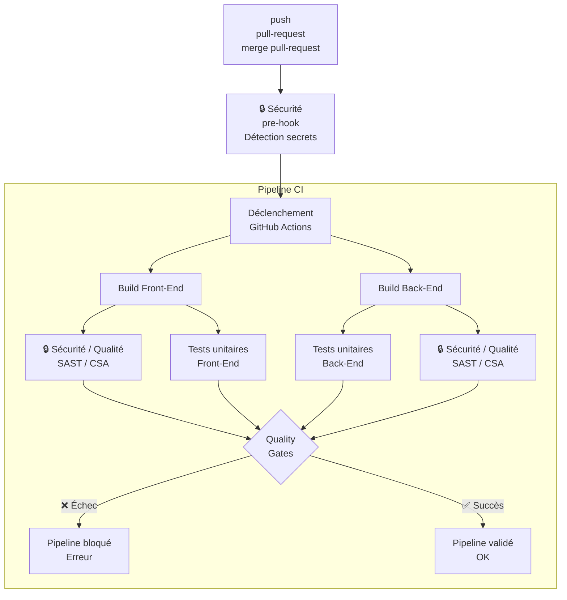

## Guide d'utilisation du pipeline CI

L’objectif du pipeline CI est de vérifier automatiquement que le code livré compile correctement et n’introduit pas de nouveaux bugs, de régressions ou de failles de sécurité.

En tant que développeur :

- Le pipeline CI est déclenché sur tout push dans une feature-branche et sur toute création/validation d'une pull-request sur les branches develop et main. Aucune intervention manuelle n'est nécessaire.

- Lors du push et avant l’envoi du code sur le dépôt, un pre-hook Git effectue un premier contrôle local, notamment pour éviter de publier accidentellement des secrets ou credentials.

- Une fois le code envoyé dans le dépôt, GitHub Actions déclenche le pipeline CI :
    - Le pipeline compile le Front-End et le Back-End
    - Le pipeline exécute les tests unitaires
    - Le pipeline exécute les analyses de qualité et de sécurité du code

- Les résultats convergent ensuite vers une étape de synthèse "Quality Gates" qui conditionne la poursuite du pipeline.

- Si tous les contrôles passent ✅, le code peut poursuivre le processus d'intégration.

- Si un contrôle échoue ❌, le pipeline est bloqué
    - Le résultat du job en erreur est consultable dans GitHub Actions
    - Une fois le problème corrigé, puis un nouveau push exécuté, le pipeline redémarre automatiquement.

## Schéma du pipeline CI

