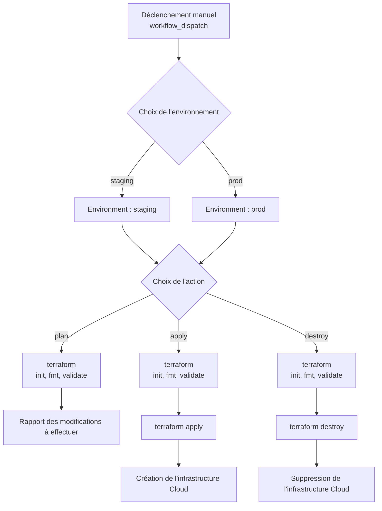

## Guide d'utilisation du pipeline Infrastructure

L'infrastructure des environnements est provisionnée à l'aide de Terraform via un workflow GitHub Actions dédié, déclenché manuellement.
Le workflow permet de crééer l’infrastructure, mais aussi de modifier ou détruire l’infrastructure existante.

Pour lancer un job d'infrastructure :

- Ouvrir le dépôt GitHub et accéder à l'onglet Actions
- Sélectionner le workflow "Trigger infrastructure deployment"
- Cliquer sur "Run workflow"

Choix de l'option

-	plan : Terraform analyse les changements dans le code sans les appliquer
-	apply : Terraform applique les changements dans le code
-	plan-destroy : Terraform analyse la destruction l’appliquer
-	destroy : Terraform détruit l’environnement
 
Choix de l'environnement

- prod / staging

- Cliquer sur "Run workflow"

## Schéma du pipeline d'infrastructure

